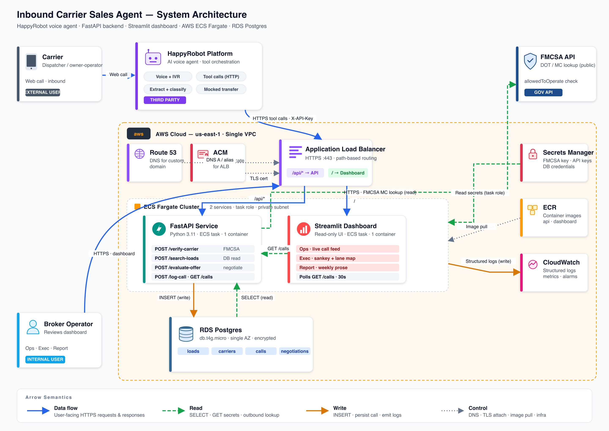

# Inbound Carrier Sales

An AI voice agent that answers inbound carrier calls for a freight brokerage: verifies the carrier via FMCSA, searches matching loads, runs a bounded 3-round rate negotiation, and hands off to a human rep on agreement. Every call is logged and surfaced on a live operations dashboard.

**Live:** <https://carrier-sales-demo.com>

Built as a proof of concept for HappyRobot's FDE technical challenge.

---

## Architecture at a glance

```
Carrier (web call)
       │
       ▼
┌─────────────────────┐
│  HappyRobot agent   │  prompt · voice · tool orchestration · post-call extraction
└──────────┬──────────┘
           │ HTTPS + X-API-Key
           ▼
┌─────────────────────────────────┐
│  AWS ALB (ACM cert, path rules) │
└──┬────────────────────────────┬─┘
   │ /api/*                     │ /*
   ▼                            ▼
┌────────────────┐      ┌─────────────────┐
│ FastAPI  (ECS) │      │ Streamlit (ECS) │
│ 9 endpoints    │      │ Ops/Exec/Report │
└──────┬─────────┘      └────────┬────────┘
       │                         │
       └──────────┬──────────────┘
                  ▼
           ┌──────────────┐
           │ RDS Postgres │
           └──────────────┘
```

| Layer | Stack |
|---|---|
| Voice agent | HappyRobot (prompt, LLM, tool orchestration, post-call nodes) |
| Backend | FastAPI · Pydantic v2 · SQLAlchemy 2 · Alembic · psycopg3 · httpx |
| Dashboard | Streamlit · Pandas · Plotly |
| Data | PostgreSQL 16 |
| Infra | AWS ECS Fargate · ALB · RDS · ACM · Route 53 · Secrets Manager · CloudWatch · ECR |
| IaC | Terraform (S3 + DynamoDB state) |

### Full architecture



<sub>Arrow semantics — <b style="color:#2563EB">solid blue</b>: data flow (HTTPS) · <b style="color:#16A34A">dashed green</b>: read (SELECT, secrets fetch, outbound lookup) · <b style="color:#D97706">solid amber</b>: write (INSERT, log emit) · <b style="color:#64748B">dotted gray</b>: control (DNS, TLS attach, image pull). Vector source: <a href="docs/assets/architecture-diagram.svg"><code>docs/assets/architecture-diagram.svg</code></a>.</sub>

See `docs/ARCHITECTURE.md` for the full system diagram and component breakdown.

---

## API

Nine endpoints, path-prefixed with `/api`. All require `X-API-Key` except `/health`.

| Endpoint | Purpose |
|---|---|
| `GET /health` | Liveness probe (no auth) |
| `POST /api/verify-carrier` | FMCSA lookup by MC number; returns eligible + carrier metadata |
| `POST /api/search-loads` | Fuzzy origin/destination match, exact equipment match, pickup date filter |
| `POST /api/evaluate-offer` | Apply the locked 3-round negotiation policy; pulls prior-round history by `session_id` |
| `POST /api/log-call` | Persist a completed call with outcome, sentiment, negotiation rounds, transcript |
| `GET /api/calls` | Paginated read with outcome + since filters |
| `GET /api/calls/{call_id}/negotiations` | Per-round offer/counter/reasoning timeline for a specific call — what the dashboard renders in the Ops drill-down to prove the agent→policy→dashboard loop |
| `GET /api/metrics/summary` | Aggregated KPIs — acceptance rate, avg margin vs loadboard, booked revenue, **estimated rep hours saved**, **estimated labor cost saved**, **recoverable declines**, **acceptance rate by sentiment** |
| `GET /api/metrics/by-equipment` | Per-equipment-type breakdown — calls, booked, acceptance rate, avg margin, avg rounds to book, revenue — the single highest-signal drill-down for a sales manager |

Full contract in `docs/API.md`. OpenAPI schema served at `/docs` on the deployed API.

---

## Negotiation policy — the interesting bit

Stateless 3-round "smart" policy that balances broker margin against time-to-close:

- **Round 1:** accept if offer ≥ `target` (0.98 × loadboard); else counter at midpoint of offer and loadboard
- **Round 2:** accept if ≥ target; else concede half the remaining gap from our round-1 counter
- **Round 3:** accept if ≥ `floor` (0.92 × loadboard); else reject (final)

Below-floor offers at R1/R2 get a signal counter at target or floor × 1.01 respectively. Every decision includes a human-readable reasoning string. All four worked examples from `docs/NEGOTIATION.md` are covered by unit tests (16 test cases).

See `docs/NEGOTIATION.md` for the exact rules and `api/app/services/negotiation.py` for the pure implementation.

---

## Dashboard

A decision tool for three audiences: a floor manager on the **Ops** tab, a commercial lead on the **Exec** tab, and a VP who wants a prose readout on the **Report** tab. Every chart is captioned with the decision it drives, not just what it shows. All tabs read from the same Postgres the agent writes to — there is no separate analytics pipeline, no mock data, no stitched-together components.

**Ops — live broker console.** Calls today, active now, booked today, acceptance today, and *recoverable declines* (carriers who walked on price but left on good terms — prime human-rep callback targets). One-click "Recoverable declines" quick filter. Filterable call feed with color-coded outcome badges. Drill into any call to see the **negotiation timeline** — one row per `/evaluate-offer` tool call the agent made during the conversation, with the exact reasoning the policy returned ("offer above floor but below target, countering at midpoint"). Full transcript and HappyRobot post-call extracted fields also visible in the drill-down.

**Exec — program overview.** Opens with a **hero agent-impact banner**: "In the last 30 days the agent handled N calls, booked $X in revenue at +Y% vs loadboard, and saved an estimated Z hours of rep time (≈ $W at $45/hr)." Below that:

- **Call flow — Sankey** — inbound calls → outcome → reason bucket, all in one diagram. Booked calls split by how much margin we gave up (at/above list, small/medium/large concession); declined calls split by whether sentiment left the door open for a recoverable callback; no-match calls split by equipment asked for. A fat "Large (>10%)" ribbon under Booked means the floor is leaking margin; a fat "Recoverable" ribbon under Carrier declined is a queue for human-rep follow-up.
- **Lane map** — every booked lane rendered as a polyline on a US map, colored by margin vs loadboard (green above list → red large concession) so margin leakage is geographic, not just aggregate. A second layer marks **no-match origins** sized by call count — orange circles where carriers called and walked because coverage was missing.
- **Where the agent is winning** — acceptance rate and avg margin by equipment type, side by side, with a decision caption pointing to the best/worst type. Tells a sales manager which equipment segments to double down on and which to tune.
- **Tone vs. close rate** — acceptance rate split by call sentiment (replaces the aimless sentiment donut), with a recoverable-declines callout. Turns sentiment from vanity into an actionable tone-recovery signal.
- **Volume & outcomes** — stacked-by-outcome timeline and outcome mix donut.
- **Avg rounds by outcome** and **margin vs loadboard histogram** — each with a bold *Decision:* caption explaining what a drop or shift in the chart should trigger.
- **Lane intelligence — supply gaps** — aggregates every `no_match` outcome by carrier origin and surfaces concrete sourcing leads ("five carriers in Dallas called and walked because the load board had no match → source more Dallas-origin freight"). The one prescriptive insight on the dashboard: it tells the broker where to *add* loads, not just describe what already happened.
- **Workhorse lanes** — top-booked-lanes ranking, week-over-week stability check.

**Report — weekly executive summary.** A prose readout of what the agent did this period, ready to forward. Headline banner + snapshot KPIs + 4–6 auto-generated bullets covering volume trend vs prior period, acceptance direction, best/worst equipment, recoverable declines, labor savings, and margin movement. Period selector (7 / 14 / 30 days). Pulls from the same metrics endpoints as the Exec tab — no new API surface.

Spurious `error` outcomes (e.g. a session that fails because the carrier closes the browser tab mid-call) are persisted for forensic visibility but excluded from the Ops live feed and from the agent-impact aggregates by default. Inspect them explicitly with `?outcome=error` or `?include_errors=true` on `/api/calls` and `/api/metrics/summary`.

Spec in `docs/DASHBOARD.md`.

---

## Local development

```bash
cp .env.example .env
# fill in FMCSA_WEBKEY; API_KEY/DASHBOARD_API_KEY can be any shared string
docker compose up --build
```

- API: <http://localhost:8000> (health at `/health`, OpenAPI docs at `/docs`)
- Dashboard: <http://localhost:8501>

The api container runs `alembic upgrade head` and seeds `data/loads.json` on start. For demo data in Ops/Exec tabs:

```bash
python scripts/seed_synthetic_calls.py
```

### Tests

```bash
cd api
python -m pytest tests/
```

**90 tests** covering negotiation policy (all 4 docs/NEGOTIATION.md worked examples verbatim), endpoint happy paths, 401 auth failures, rate limiting, FMCSA mocking, metrics aggregation (incl. rep-hours-saved, recoverable declines, acceptance-by-sentiment, per-equipment breakdown, the per-call negotiation timeline, and the error-outcome filter behavior on both `/calls` and `/metrics/summary`), and defensive coercion for LLM-originated tool-call payloads (number-to-string, flexible datetime, transcript array flattening).

If the local environment has a pytest plugin conflict (common on anaconda boxes), run with autoloading disabled:

```bash
PYTEST_DISABLE_PLUGIN_AUTOLOAD=1 python -m pytest tests/
```

---

## AWS deploy

Terraform provisions the full stack (VPC, NAT, ALB, ACM cert, RDS, ECS, ECR, Secrets Manager, CloudWatch, Cloud Map service discovery).

```bash
AWS_PROFILE=carrier-sales scripts/bootstrap-tf-state.sh  # once per account
cd infra
export AWS_PROFILE=carrier-sales
export TF_VAR_fmcsa_webkey="..."
terraform init
terraform apply
cd ..
AWS_PROFILE=carrier-sales scripts/build-and-push.sh
```

Full runbook, cost breakdown, and teardown instructions in `infra/README.md`.

**Estimated cost:** ~$78/mo (biggest line item is the NAT gateway at ~$32/mo).

---

## Project layout

```
carrier-sales-agent-hr-fdec/
├── README.md                 ← you are here
├── docs/                     ← specs and design docs (human-authored)
├── api/                      ← FastAPI backend + Alembic + tests
├── dashboard/                ← Streamlit Ops / Exec / Report tabs
├── infra/                    ← Terraform modules
├── data/                     ← seed loads (loads.json)
├── happyrobot/               ← HappyRobot workflow artifacts (tool defs, prompts)
├── scripts/                  ← bootstrap, build-and-push, synthetic seeder
└── docker-compose.yml
```

---

## For reviewers

Recommended reading order:

1. **`docs/SPEC.md`** — what this is, the call flow, the acceptance criteria
2. **`docs/ARCHITECTURE.md`** — how the pieces fit
3. **`docs/NEGOTIATION.md`** — the core business logic
4. **`api/app/services/negotiation.py`** — 150 lines that implement it
5. **`api/tests/test_negotiation.py`** — proof that it matches the spec
6. **`docs/SECURITY.md`** — what's PoC-grade vs production-grade

The `docs/` directory is the source of truth for what the system should do; the `api/`, `dashboard/`, and `infra/` directories are how it actually does it.
